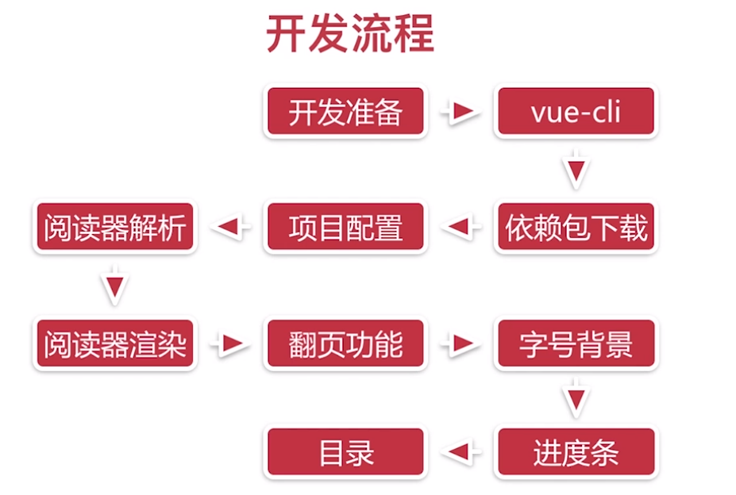
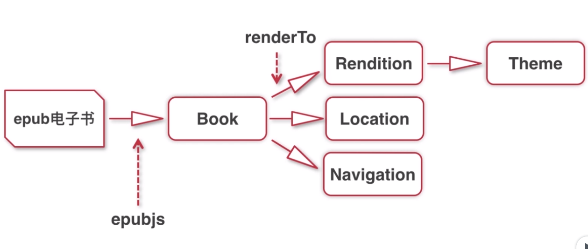

# ebook
Vue.js来实现一个手机阅读器，实现电子书的阅读功能，以及一些辅助功能，如翻页、字号设置、主题设置、阅读进度调整和电子书目录。

## 阅读器工作原理及开发流程


### epub 和 mobi
- epub（Electronic Publication）电子出版物
- mobi 是 Amazon kindle 的电子书格式

### 开发流程


### 准备工作
安装：
```
npm install node-sass sass-loader -D

npm install epubjs -S
```

### viewport 配置
- viewport 用来设置用户在手机上的可视区域
- width=device-width：指定 viewport 宽度为设备宽度，initial-scale=1.0：指定默认缩放比为1：1
- 通过 maximum-scale 和 minimum-scale 限定屏幕缩放比例为 1：1，通过 user-scalable 限制用户对屏幕进行缩放。

### rem 配置
- rem 是 css3 新增的一个相对长度单位
- rem 的值相当于根元素 font-size 值的倍数
- DOMContentLoaded 事件动态设置根元素 font-size
html.style.fontSize = window.innerWidth/10 + 'px'

### reset.scss 和 global.scss
- 实现 px2rem 方法，将 px 转化为 rem

### epubjs 的核心工作原理解析


## Project setup
```
npm install
```

### Compiles and hot-reloads for development
```
npm run serve
```

### Compiles and minifies for production
```
npm run build
```

### Run your tests
```
npm run test
```

### Lints and fixes files
```
npm run lint
```
